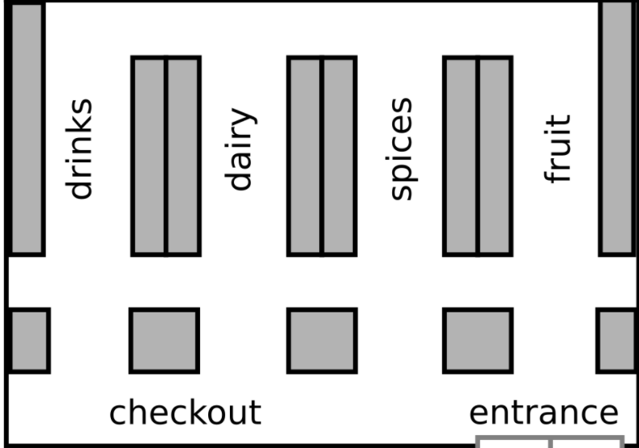

# Supermarket Markov Chain Simulation by The Statistically Significant Four
The Project runs a Monte Carlo simulation to predict the customers' behavior in 
a hypothetical supermarket with below layout

## Repo Structure

### 1. MCMC Simulation
    * For calculating the transition matrix -> proba.py
    * For Classes -> supermarket.py
    * For Visulaization of Monte Carlo Simulation -> visualization.py
    * for checking the simulation data -> output folder

### 2. Notebooks
    * For exploratory data analysis -> EDA.ipynb
    * For summary on Markov-Chains theory -> theory.ipynb

### 3. Data
    * For raw daily supermarket data with csv format -> data
    * For cleaned and final data, ready for calucating transition matrix -> data -> cleaned-up

