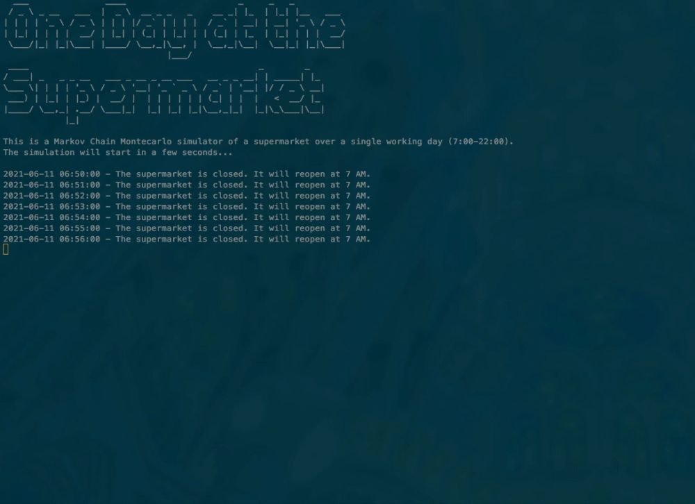

# Supermarket Markov Chain Simulation by Statistically Significant Four

A Monte Carlo Markov Chain simulation to predict the customers' behavior in a hypothetical supermarket with below layout:

# Usage
`python supermarket.py` 

## Repo Structure

### 1. MCMC Simulation
- supermarket.py -> The executable script that runs the simulation
- proba.py -> The calculation of the transition matrix
- visualization.py -> For an old-fashioned videogame-like visualization of the Monte Carlo Simulation
- For checking the simulation output data -> output folder

### 2. Notebooks
- For exploratory data analysis -> EDA.ipynb
- For summary on Markov-Chains theory -> theory.ipynb

### 3. Data
- data -> The daily supermarket raw data that form the dataset of this model (in csv format)
- data/cleaned-up -> Crean data created in EDA.ipynb, and ready for calucating the transition matrix

### 4. Output
- MCMC_Simulation -> The results of the simulation in .csv file after running supermarket.py 
- dungeon_supermarket map -> buited in visualization.py

#### Credits
This project was done in collaboration with Bartolini Laura Francesco Mari & Behzad Azarhoushang.

